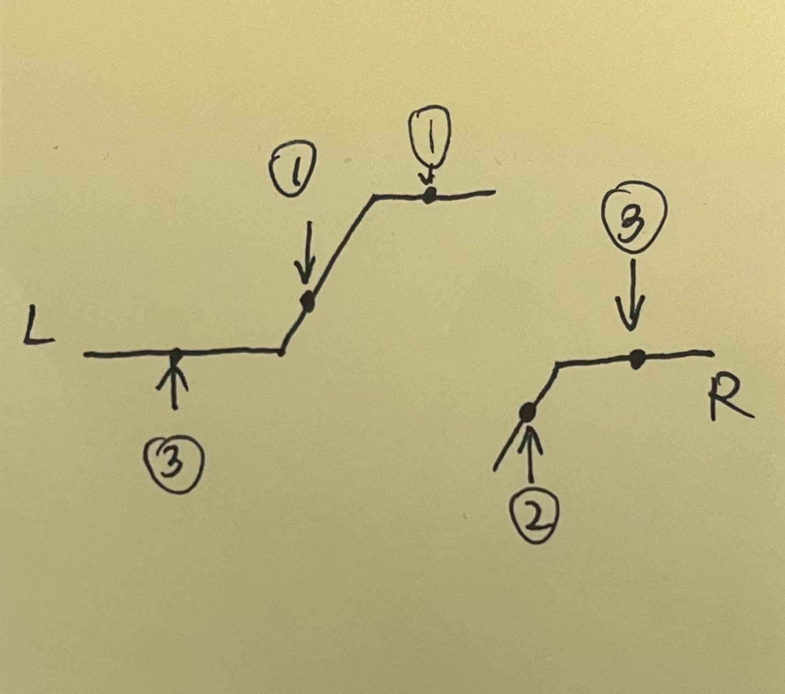

# 154. Find Minimum in Rotated Sorted Array II

## 题目

.png>)

#### Leetcode链接：[https://leetcode.com/problems/find-minimum-in-rotated-sorted-array-ii/](https://leetcode.com/problems/find-minimum-in-rotated-sorted-array-ii/)

## 解法一

Clarification:&#x20;

Algorithm:&#x20;

使用二分法，有三种情况

case 1: 当mid的值比right大，说明要找的min在mid的右边，那么left = mid + 1，可以+ 1是因为我们已经知道当前mid比right大了，可以舍弃

case 2: 当mid的值小于right，说明min在mid的左边，left = mid，因为我们不确定mid是不是最小值，所以我们不能跳过当前mid

case 3: 当mid与left 和right相等时，无法判断以及舍弃其中一边，此时可以更新最右边。因为已知     right == mid,所以 right--，继续循环二分



#### <mark style="color:red;">注意：</mark>

## 代码

```java
class Solution {
    public int findMin(int[] nums) {
        if (nums.length <= 1) return nums[0];
        
        int left = 0;
        int right = nums.length - 1;
        
        while (left < right) {
            int mid = left + (right - left) / 2;
            if (nums[mid] > nums[right]) {
                left = mid + 1;
            } else if (nums[mid] < nums[right]) {
                right = mid;
            } else {
                right--;
            }
        }
        
        return nums[left];
    }
}
```

#### TC & SC:&#x20;

1. TC: O(logn)
2. SC: O(1)
