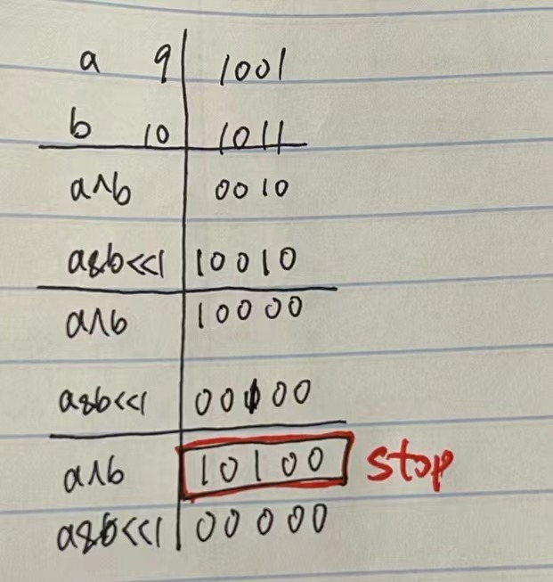

# 371. Sum of Two Integers

## 题目

.png>)

#### Leetcode链接：[https://leetcode.com/problems/sum-of-two-integers/](https://leetcode.com/problems/sum-of-two-integers/)

#### 参考Youtube：[https://www.youtube.com/watch?v=gVUrDV4tZfY](https://www.youtube.com/watch?v=gVUrDV4tZfY)

## 解法一

> Clarification: 不能使用加减法
>
> Algorithm:&#x20;
>
> * 使用Bitwise operation
> * 
> * 在计算1 和 0的时候，如果两个都是1，那么需要进一位。存储进位tmp --> (a & b) << 1
> * 每一次计算一下a XOR b，再把b设置为tmp，直到b为零

#### <mark style="color:red;">注意：</mark>

## 代码

```java
class Solution {
    public int getSum(int a, int b) {
        while (b != 0) {
            int tmp = (a & b) << 1;
            a = a ^ b;
            b = tmp;
        }
        
        return a;
    }
}
```

#### TC & SC:&#x20;

1. TC: O(1)
2. SC: O(1)
