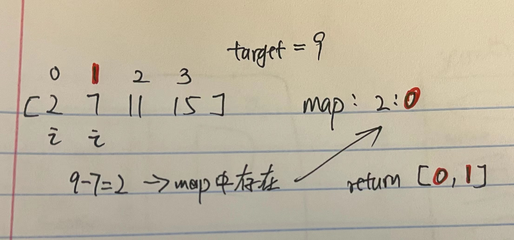

# 1. Two Sum

## 题目

 (2).png>)

#### Leetcode链接：[https://leetcode.com/problems/two-sum/](https://leetcode.com/problems/two-sum/)

#### Youtube参考：

## 解法一

> Clarification:&#x20;
>
> Algorithm:&#x20;
>
> * 用hashmap，key是当前element的值，value是当前element的index
> * 遍历数组，如果map中存在target与当前element的差值，那么直接get此差值的index，与当前element一起返回，不然就把element与index放到map中



#### <mark style="color:red;">注意：</mark>

## 代码

```java
class Solution {
    public int[] twoSum(int[] nums, int target) {
        HashMap<Integer, Integer> map = new HashMap<>();
        for (int i = 0; i < nums.length; i++) {
            if (map.containsKey(target - nums[i])) {
                return new int[] {map.get(target - nums[i]), i};
            }
            map.put(nums[i], i);
        }
        
        return new int[] { -1, -1 };
    }
}
```

#### TC & SC:&#x20;

> TC: O(n) 遍历数组
>
> SC: O(n) hashmap，最差所有element都放进去
