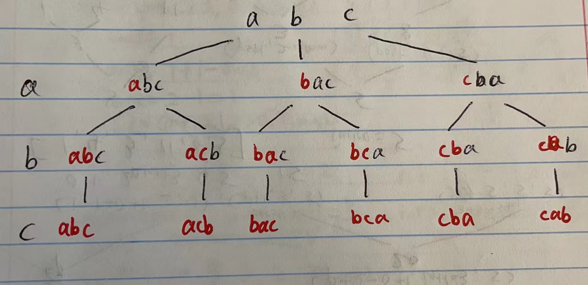

# 643. All Permutations of Subsets

## 题目

 (1).png>)

#### 链接：[https://app.laicode.io/app/problem/643?plan=3](https://app.laicode.io/app/problem/643?plan=3)

## 解法一

Clarification:&#x20;

Algorithm:&#x20;

1. 与64.All Permutations I 类似。唯一的不同是，64是需要返回特定的大小，而这道题返回的是在书中的所有节点。所以只需要每一次都把tree的节点放进list中就好



 (1).png>)

#### <mark style="color:red;">注意：</mark>

## 代码

```java
public class Solution {
  public List<String> allPermutationsOfSubsets(String set) {
    List<String> res = new ArrayList<>();
    if (set == null) {
      return res;
    }

    char[] array = set.toCharArray();
    dfs(array, 0, res);
    return res;
  }

  private void dfs(char[] array, int index, List<String> res) {
    res.add(new String(array, 0, index));

    for (int i = index; i < array.length; i++) {
      swap(array, index, i);
      dfs(array, index + 1, res);
      swap(array, index, i);
    }

  }

  private void swap(char[] array, int left, int right) {
    char temp = array[left];
    array[left] = array[right];
    array[right] = temp;
  }
}

```

#### TC & SC:&#x20;

1. TC: O(n!)
   1. 树杈：<mark style="color:red;">3， 2， 1</mark>
   2. 树高：n
2. SC: O(n)
