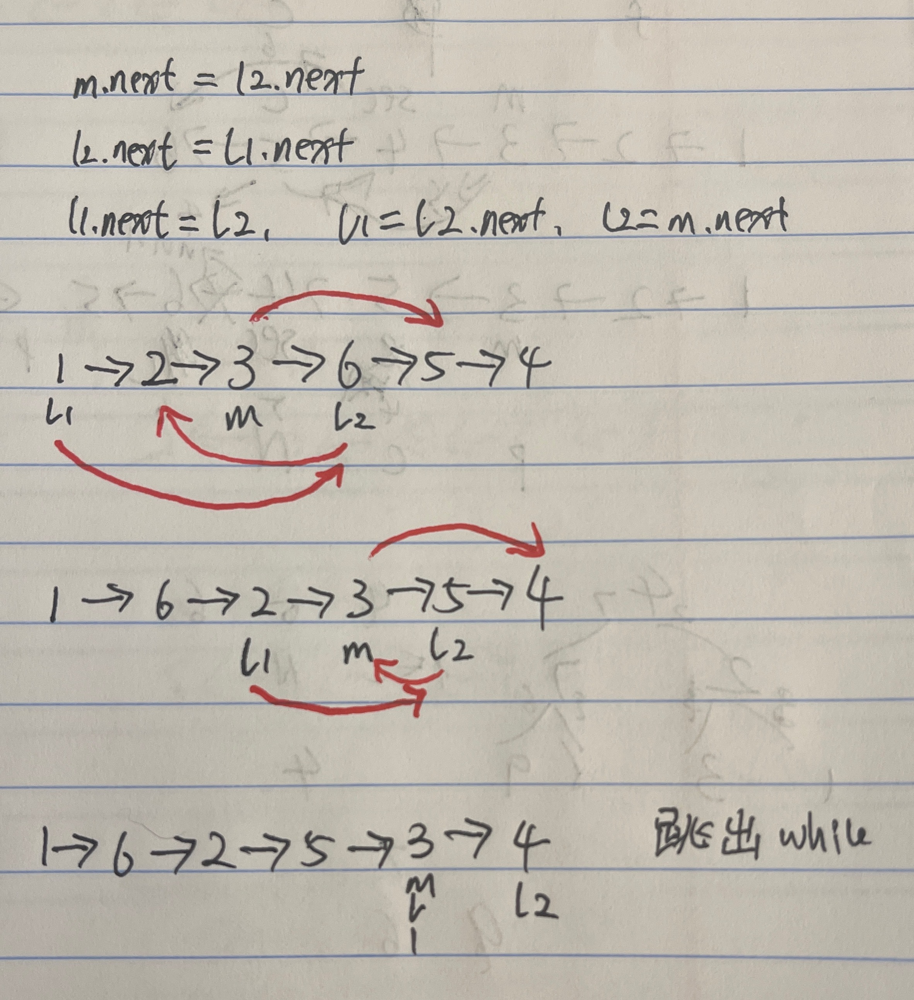

# 143. Reorder List

## 题目

.png>)

#### Leetcode链接：[https://leetcode.com/problems/reorder-list/](https://leetcode.com/problems/reorder-list/)

#### Youtube参考：

## 解法一

> Clarification:&#x20;
>
> Algorithm:&#x20;
>
> * 找到中点，reverse中点后半部分，再merge
> * 

#### <mark style="color:red;">注意：</mark>

## 代码

````java
```java
/**
 * Definition for singly-linked list.
 * public class ListNode {
 *     int val;
 *     ListNode next;
 *     ListNode() {}
 *     ListNode(int val) { this.val = val; }
 *     ListNode(int val, ListNode next) { this.val = val; this.next = next; }
 * }
 */
class Solution {
    public void reorderList(ListNode head) {
        if (head == null) return;
        
        // find mid
        ListNode mid = findMid(head);
        
        // reverse
        ListNode l2 = reverse(mid.next);
        mid.next = null;
        
        // merge
        // merge(head, mid.next, mid);
        merge(head, l2);
    }
    
    // find mid
    private ListNode findMid(ListNode head) {
        ListNode slow = head, fast = head;
        while (fast.next != null && fast.next.next != null) {
            slow = slow.next;
            fast = fast.next.next;
        }
        
        return slow;
    }
    
    // reverse
    private ListNode reverse(ListNode head) {
        ListNode prev = null;
        while (head != null) {
            ListNode next = head.next;
            head.next = prev;
            prev = head;
            head = next;
        }
        
        return prev;
    }
    
    // // merge
    // private void merge(ListNode l1, ListNode l2, ListNode mid) {
    //     while (l1 != mid) {
    //         mid.next = l2.next;
    //         l2.next = l1.next;
    //         l1.next = l2;
    //         l1 = l2.next;
    //         l2 = mid.next;
    //     }
    // }
    // merge
    private void merge(ListNode l1, ListNode l2) {
        while (l2 != null) {
            ListNode l1n = l1.next;
            ListNode l2n = l2.next;

            l1.next = l2;
            l2.next = l1n;

            l1 = l1n;
            l2 = l2n;
        }
    }
}
```
````

#### TC & SC:&#x20;

> TC: O(n)
>
> SC: O(1)
