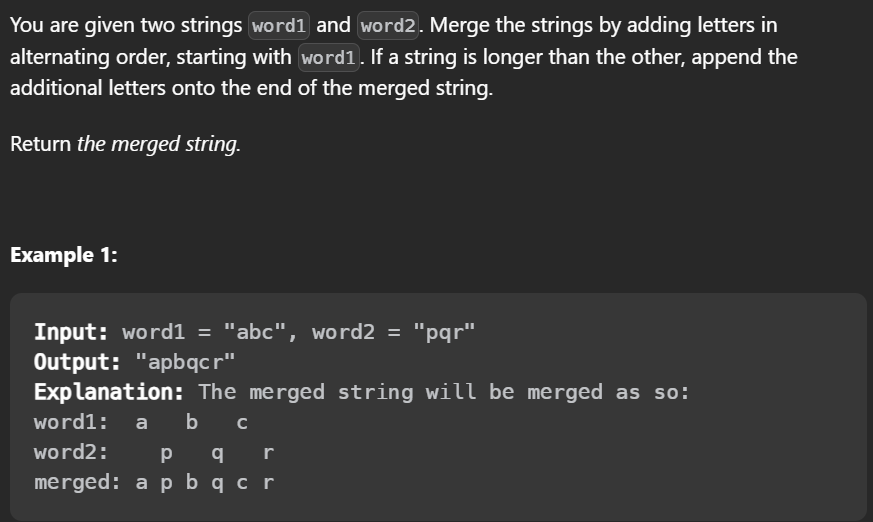

# 199. Binary Tree Right Side View

## 题目

<figure><figcaption></figcaption></figure>

#### Leetcode链接：[https://leetcode.com/problems/binary-tree-right-side-view/description/](https://leetcode.com/problems/binary-tree-right-side-view/description/)

#### Youtube参考：

## 解法一

> Clarification:&#x20;
>
> Algorithm:&#x20;
>
> * BFS做法，因为会记录每一层的node个数，所以只要把本层最后一个node 加到list即可

#### <mark style="color:red;">注意：</mark>

## 代码

````java
```java
/**
 * Definition for a binary tree node.
 * public class TreeNode {
 *     int val;
 *     TreeNode left;
 *     TreeNode right;
 *     TreeNode() {}
 *     TreeNode(int val) { this.val = val; }
 *     TreeNode(int val, TreeNode left, TreeNode right) {
 *         this.val = val;
 *         this.left = left;
 *         this.right = right;
 *     }
 * }
 */
class Solution {
    public List<Integer> rightSideView(TreeNode root) {
      List<Integer> res = new ArrayList<>();
      if (root == null) return res;
      Queue<TreeNode> q = new LinkedList<>();
      q.offer(root);
      while (!q.isEmpty()) {
        int size = q.size();
        for (int i = 0; i < size; i++) {
          TreeNode cur = q.poll();
          if (i == size - 1) {
            res.add(cur.val);
          }
          if (cur.left != null) {
            q.offer(cur.left);
          }

          if (cur.right != null) {
            q.offer(cur.right);
          }
        }
      }

      return res;
    }
}
```
````

#### TC & SC:&#x20;

> TC: O()
>
> SC: O()
