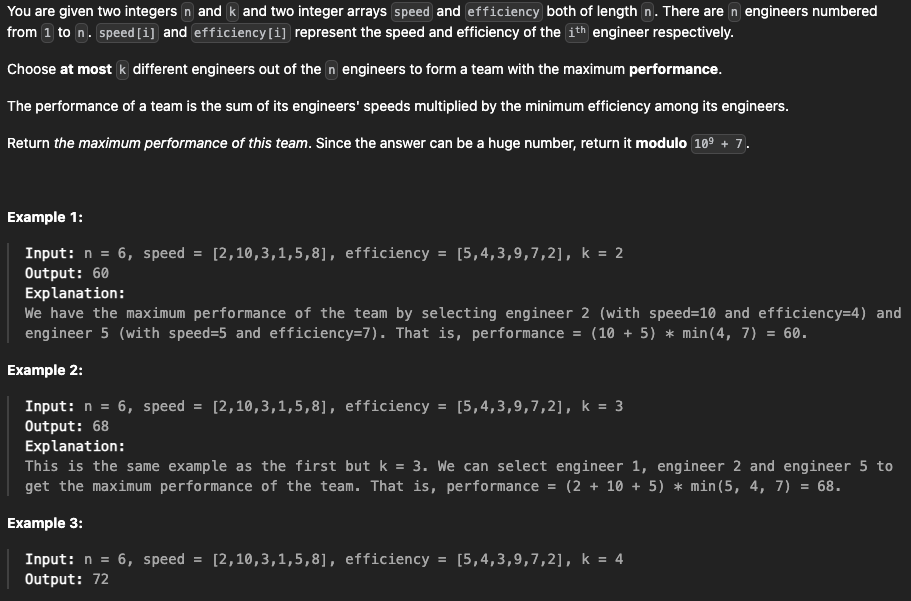

# 23. Shift Position

## 题目

<figure><figcaption></figcaption></figure>

#### Leetcode链接：[https://app.laicode.io/app/problem/23?plan=3](https://app.laicode.io/app/problem/23?plan=3)

#### Youtube参考：

## 解法一

> Clarification:&#x20;
>
> Algorithm:&#x20;
>
> * base case:&#x20;
>   * if given arr is null or length == 0, return -1
> * &#x20;if left < right, return left directly
> * use binary search way to search, to find the cliff, we need to see if a\[mid] > a\[mid + 1], if yes, return mid + 1, else, keep find

#### <mark style="color:red;">注意：</mark>

## 代码

```java
public int shiftPosition(int[] nums) {
  if (nums == null || nums.length == 0) return -1;

  int left = 0;
  int right = nums.length - 1;
  
  if (nums[left] <= nums[right]) return left;
  
  while (left <= right) {
      int mid = left + (right - left) / 2;
      if (nums[mid] > nums[mid + 1]) return mid + 1;
      
      if (nums[left] <= nums[mid]) {
          left = mid + 1;
      } else {
          right = mid - 1;
      }
  }

  return -1;
}
```

#### TC & SC:&#x20;

> TC: O(logn)
>
> SC: O(1)

## **Similar Questions:**&#x20;
